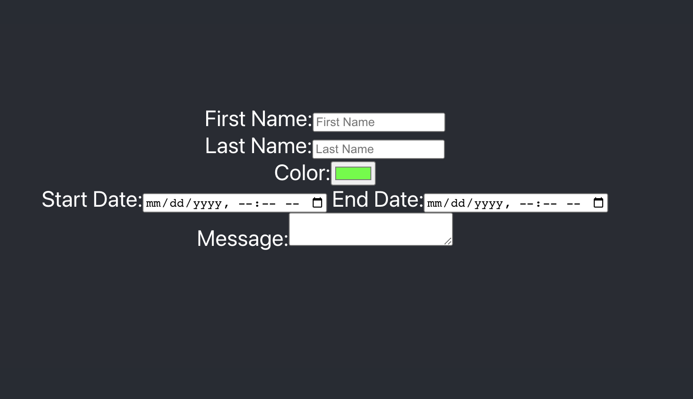

# Form Practice - React.js App 
Building a React app with onchange functionality for an HTML form for BocaCode 
C-10 in class practice.

## Link
[See Link](https://form-practice-iv.web.app/)



...
## Covered In class 
* onChange
* Form Elements
* Controlled Components 


## Basic Code
```
<label> First Name: 
<input> tpye="text">
</label>
```
